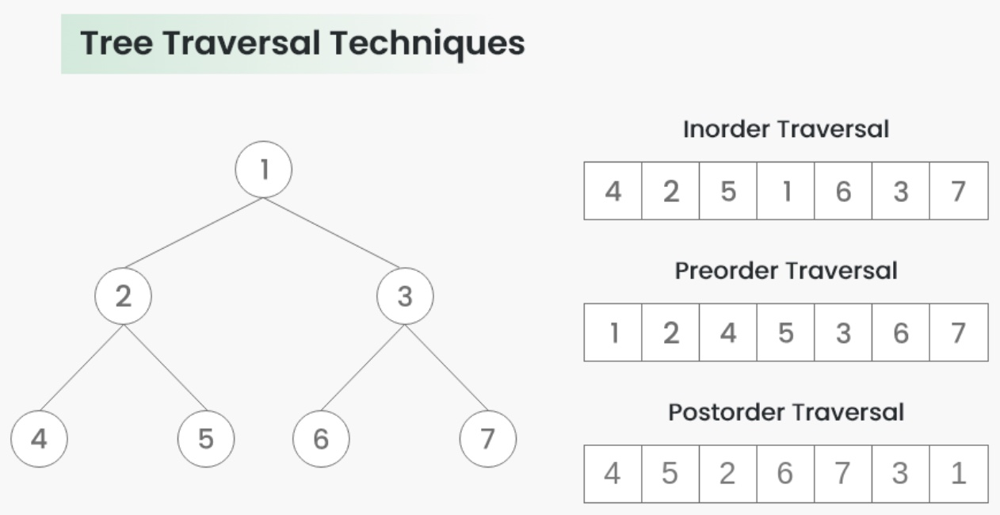

A Tree Data Structure can be traversed in following ways:

1. Depth First Search or DFS
    - Inorder Traversal
    - Preorder Traversal
    - Postorder Traversal
2. Level Order Traversal or Breadth First Search or BFS
3. Boundary Traversal
4. Diagonal Traversal

## Inorder Traversal
1. Traverse left subtree, i.e., call Inorder(left->subtree)
2. Visit root.
3. Traverse right subtree, i.e., call Inorder(right->subtree)

## Preorder Traversal
1. Visit root.
2. Traverse left subtree, i.e., call Preorder(left->subtree)
3. Traverse right subtree, i.e., call Preorder(right->subtree) 

## Postorder Traversal
1. Traverse left subtree, i.e., call Postorder(left->subtree)
2. Traverse right subtree, i.e., call Postorder(right->subtree)
3. Visit root